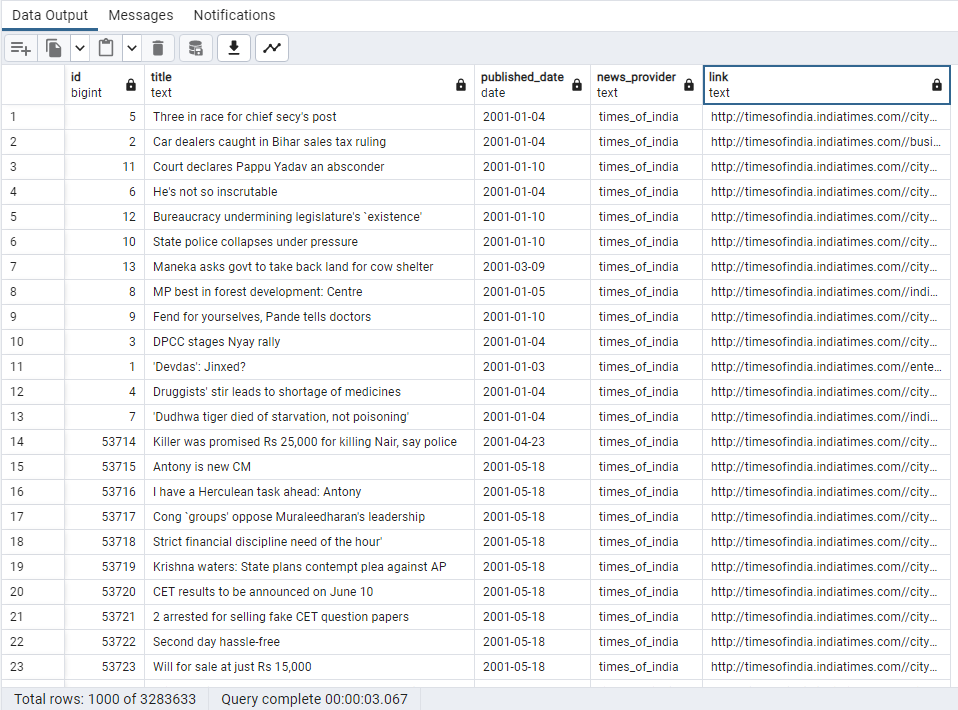

A postgres database dump of over 3 mil records of indian news articles [from the hindu and times of india] and the permalink to that particular article.

If you use this dataset, consider giving a star ⭐

# Schema

```
news (
    id bigint,
    title text,
    published_date date,
    news_provider text,
    link text
)
```

# What to expect?



# License

CREDIT THE AUTHOR aka Suvarna Narayanan!

[LICENSE](LICENSE)